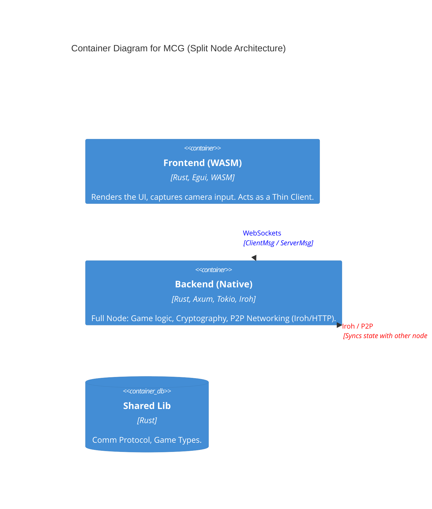

# Architecture

This document describes the high-level architecture of the Mental Card Game (MCG) project, focusing on the client-server interaction and the module structure.

## Overview

The application follows a **Client-Server** architecture where the state is authoritative on the server (Backend) and replicated to clients (Frontend) via WebSockets.

- **Frontend**: A WebAssembly (WASM) application built with Rust and `egui` (via `eframe`). It runs in the browser.
- **Backend**: A Rust native application building on `axum` and `tokio`. It manages the game state and bots.
- **Shared**: A common crate containing data structures, game logic, and the communication protocol.
- **QR Comm**: A specialized crate for data transmission via QR codes using network coding (Fountain codes).

### Frontend Capabilities
The frontend provides a robust foundation for building card games with the following core features:
-   **WASM & Rust Powers**: High-performance game logic running in the browser.
-   **Immediate Mode UI**: Built on `egui` for rapid iteration and dynamic interfaces.
-   **Visual Card Management**:
    -   **Drag & Drop**: Intuitive mechanics for moving cards between different zones (stacks, player hands, etc.).
    -   **Local Asset Loading**: Capability to validly load card images from a local directory served via HTTP.
-   **Configurable Game State**: Support for configurable number of players and flexible initial game setups.
-   **Extensible Architecture**: Traits and structs designed for easy extension to support various card game rules and visuals.

## System Context (C4)

## Architectural Concepts

### 1. Split Node Architecture
As described in the project report, the system is designed around a **Split Node** concept.
-   **Each Player is a Node**: Every user runs a full instance comprising both the WASM Frontend and the Native Backend.
-   **Thin Client**: The Frontend is strictly a view layer ("Game state -> Pretty pictures"). It handles input and rendering but contains minimal game logic.
-   **Native Power**: The Backend handles all heavy lifting: game engine, cryptography (ZK proofs), and P2P networking. This bypasses WASM limitations (sandboxing, lack of threading/sockets).

### 2. P2P & Transports
The system supports multiple transport layers for the same protocol (`ClientMsg`/`ServerMsg`):
-   **WebSockets**: For communication between a Frontend and its local Backend.
-   **Iroh**: A P2P library used for node-to-node communication (NAT traversal, hole punching).
-   **QR Codes**: An alternative transport for exchanging data (and potentially bootstrapping connections) in air-gapped or localized settings.

## Module Responsibilities

### 1. Frontend (`frontend/`)
The frontend is the user's entry point. It handles:
-   **Rendering**: Uses `egui` immediate mode GUI.
-   **State Management**: Holds a local replica of `GameStatePublic`.
-   **Routing**: Manages screens (`/receive`, `/transmit`, `/game`, etc.) via a registry.
-   **Camera/QR**: Wraps browser media APIs (via `web-sys`) to capture video frames for QR scanning.

### 2. Backend (`native_mcg/`)
The backend is the source of truth. It handles:
-   **Game Loop**: Processes `PlayerAction`s, updates the `Game` state, and pushes updates.
-   **Bot Logic**: Manages AI players (`BotManager`).
-   **HTTP/WS Server**: Serves the WASM assets and handles WebSocket connections at `/ws`.
-   **Test Data**: currently serves static files for QR testing via `QrRes` messages (in the test branch).

### 3. Shared (`shared/`)
Contains the "business logic" and "domain objects":
-   `Game`, `Player`, `Card`: Core poker logic.
-   `ClientMsg`, `ServerMsg`: Serialization contracts.
-   **Terminology Note**: In this P2P system, "Client" and "Server" are roles, not fixed identities. A node acts as a **Server** when receiving a connection/request, and as a **Client** when initiating one. The message enums (`ClientMsg`/`ServerMsg`) reflect the *direction* of data, not the type of the device.

### 4. QR Comm (`crates/qr_comm/`)
Implements the protocol for transmitting data over a series of QR codes.
-   **Network Coding**: Uses Galois Field arithmetic to create linear combinations of data fragments.
-   **Fountain Code**: Allows the receiver to reconstruct the original data from *any* sufficient subset of received frames, handling packet loss (missed QR frames) gracefully.

## Data Flow (Game Loop)

1.  **User Action**: User clicks "Fold" on Frontend.
2.  **Message**: Frontend sends `ClientMsg::Action { player_id, action: Fold }` to Backend.
3.  **Validation**: Backend validates turn order and legality of move in `state.rs`.
4.  **Update**: Backend calls `Game::apply_action`, updating the authoritative state.
5.  **Broadcast**: Backend broadcasts `ServerMsg::State(GameStatePublic)` to *all* connected clients.
6.  **Render**: Frontend receives the new state and re-renders the UI.
