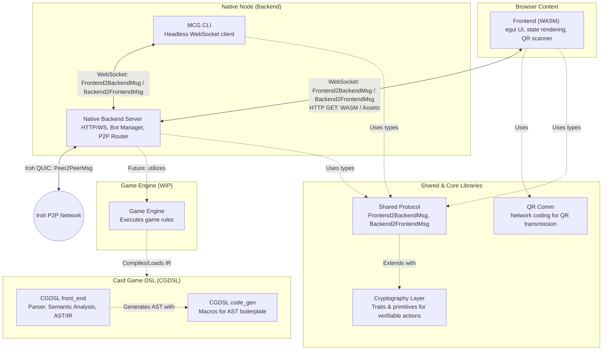

# Architecture

## Overview

The application follows a **Frontend-Backend / P2P Node** architecture. Currently, state is authoritative on the Backend and replicated to Frontends via WebSockets. However, the system is designed around a **Split Node** concept where each player runs their own Backend and Frontend, eventually communicating peer-to-peer.

- **Frontend**: A WebAssembly (WASM) application built with Rust and `egui` (via `eframe`). It runs in the browser.
- **Backend**: A Rust native application building on `axum` and `tokio`. It manages the game state, serves assets, and handles network transport.
- **Shared / Cryptography**: Common crates containing data structures, game logic, communication protocols, and cryptographic primitives for verifiable actions.
- **CGDSL**: A Card Game Domain-Specific Language designed to formalize rules and generate game execution state machines.

## System Components & Interfaces

The following diagram illustrates the components in the workspace and their relationships. 

```mermaid
flowchart TB
    subgraph BrowserContext["Browser Context"]
        Frontend["Frontend (WASM) <br/>egui UI, state rendering, QR scanner"]
    end

    subgraph NativeNode["Native Node (Backend)"]
        Backend["Native Backend Server <br/>HTTP/WS, Bot Manager, P2P Router"]
        CLI["MCG CLI<br/>Headless WebSocket client"]
    end

    IrohNetwork((Iroh P2P Network))

    subgraph CoreLibs["Shared & Core Libraries"]
        Shared["Shared Protocol<br/>Frontend2BackendMsg, Backend2FrontendMsg"]
        Crypto["Cryptography Layer<br/>Traits & primitives for verifiable actions"]
        QRComm["QR Comm<br/>Network coding for QR transmission"]
    end

    subgraph FutureEngine["Game Engine (WIP)"]
        Engine["Game Engine<br/>Executes game rules"]
    end

    subgraph DSL["Card Game DSL (CGDSL)"]
        FrontEndDSL["CGDSL front_end<br/>Parser, Semantic Analysis, AST/IR"]
        CodeGen["CGDSL code_gen<br/>Macros for AST boilerplate"]
    end

    %% Network Interfaces
    Frontend <-->|WebSocket: Frontend2BackendMsg / Backend2FrontendMsg<br/>HTTP GET: WASM / Assets| Backend
    CLI <-->|WebSocket: Frontend2BackendMsg / Backend2FrontendMsg| Backend
    Backend <-->|Iroh QUIC: Peer2PeerMsg| IrohNetwork

    %% Direct API / Library usages
    Frontend -.->|Uses| QRComm
    Backend -.->|Future: utilizes| Engine
    Engine -.->|Compiles/Loads IR| DSL
    FrontEndDSL -.->|Generates AST with| CodeGen

    %% Shared dependencies
    Frontend -.->|Uses types| Shared
    Backend -.->|Uses types| Shared
    CLI -.->|Uses types| Shared
    Shared -.->|Extends with| Crypto
```

## Architectural Concepts

### 1. Split Node Architecture
The system is designed around a **Split Node** concept.
- **Each Player is a Node**: Every user runs a full instance comprising both the WASM Frontend and the Native Backend.
- **Thin Client**: The Frontend is strictly a view layer ("Game state -> Pretty pictures"). It handles input and rendering but contains minimal game logic.
- **Native Power**: The Backend handles all heavy lifting: game engine execution, cryptography (ZK proofs), and P2P networking. This bypasses WASM limitations (sandboxing, lack of threading/sockets).

### 2. P2P & Transports
The system supports multiple transport layers:
- **WebSockets**: For communication between a Frontend and its local Backend. (Using `Frontend2BackendMsg` and `Backend2FrontendMsg` as message types)
- **Iroh**: A P2P library used for node-to-node communication (with `Peer2PeerMsg`), featuring NAT traversal and hole punching.
- **QR Codes**: An alternative transport for exchanging data (and potentially bootstrapping connections) in air-gapped or localized settings.

## Module Responsibilities

### 1. Frontend (`frontend/`)
The frontend is the user's entry point. It handles:
- **Rendering**: Uses `egui` immediate mode GUI.
- **State Management**: Holds a local replica of `GameStatePublic`.
- **Routing**: Manages screens (`/receive`, `/transmit`, `/game`, etc.) via a registry.
- **Camera/QR**: Wraps browser media APIs (via `web-sys`) to capture video frames for QR scanning.

### 2. Backend (`native_mcg/`)
The native server application. It handles:
- **Game Engine Integration (Future)**: Will utilize the WIP Game Engine to step through game loops.
- **HTTP/WS Server**: Serves the WASM assets and handles WebSocket connections at `/ws`.

### 3. Shared (`shared/`)
Contains the "business logic" and "domain objects":
- **Protocol Enums**: `Frontend2BackendMsg`, `Backend2FrontendMsg`, and `Peer2PeerMsg` define the serialization contracts.
- **Game Types**: Core poker logic like `Game`, `Player`, `Card`.

### 4. Cryptography Layer (WIP)
A dedicated layer (living within `shared/communication` and upcoming modules) for Mental Card Game mechanics:
- **Verifiable Actions**: Provides traits and structures (e.g., `ElgamalCiphertext`, `ModularElement`) so that MCG actions (like drawing or shuffling cards) can be cryptographically verified by other players without trusting a central server.
- **Protocols**: Supports ZK proofs and encrypted state transitions.

### 5. Card Game DSL (CGDSL)
A bespoke language and compiler toolchain designed to generalize the game rules beyond hardcoded poker.
- **`front_end`**: The compiler front-end that parses `.cg` files. It converts the syntax into an Abstract Syntax Tree (AST), performs semantic validation, and lowers the logic into an Intermediate Representation (IR) / Finite State Machine (FSM).
- **`code_gen`**: A macro-heavy crate that automates the generation of spanned ASTs (retaining code source locations) to remove structural boilerplate.
- **Future Integration**: A dedicated Game Engine (currently on the `dev/akeller` branch) runs the IR generated by this DSL. The Native Backend will utilize this Game Engine to execute arbitrary card games.

### 6. QR Comm (`crates/qr_comm/`)
Implements the protocol for transmitting data over a series of QR codes.
- **Network Coding**: Uses Galois Field arithmetic to create linear combinations of data fragments.
- **Fountain Code**: Allows the receiver to reconstruct the original data from *any* sufficient subset of received frames, handling packet loss gracefully.

## Data Flow (Game Loop)

1. **User Action**: User clicks "Fold" on Frontend.
2. **Message**: Frontend sends `Frontend2BackendMsg::Action { player_id, action: Fold }` via WebSocket.
3. **Engine Evaluation**: The Backend delegates the action to the Game Engine, evaluating it against the current State Machine (IR).
4. **State Transition**: The Game Engine updates the authoritative state.
5. **Broadcast**: Backend broadcasts `Backend2FrontendMsg::State(GameStatePublic)` to connected frontends.
6. **Peer Synchronization**: The backend propagates state transitions to participating peers over the Iroh network using `Peer2PeerMsg`. This synchronization process utilizes cryptographic proofs and arguments to establish trust and independently verify actions, as the architecture fundamentally operates without a centralized authoritative third party.
7. **Render**: Frontend receives the new state and re-renders the UI.
