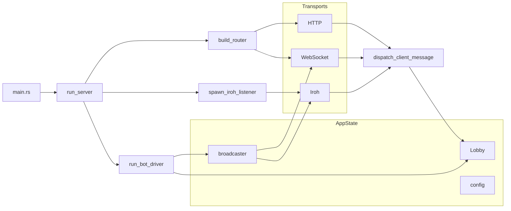

# native_mcg

**native_mcg** is the backend for the MCG (Mental Card Game) poker server. It is a Rust async server built with **Tokio** and **Axum**. It serves the Web UI (HTML, WASM, and media), exposes a **WebSocket** endpoint (`/ws`) and an **HTTP API** (`/api/message`) for the frontend, and optionally an **Iroh** QUIC transport for peer-to-peer or remote clients. The protocol and domain types (`ClientMsg`, `ServerMsg`, `GameStatePublic`, etc.) live in the **mcg-shared** crate; both the backend and the frontend depend on it.

---

## How is the backend started?

The server is started from the **native_mcg** binary. The program entry point is [native_mcg/src/main.rs](../native_mcg/src/main.rs); execution begins in the **`main`** function, which is annotated with `#[tokio::main]` so that it runs on the Tokio async runtime.

### What happens inside `main`

At an architectural level, `main` performs these steps in order:

1. **CLI parsing**  
   Arguments are parsed via [ServerCli](../native_mcg/src/cli/mod.rs) (Clap). Supported options include `--config`, `--debug`, `--iroh-key`, and `--persist`.

2. **Logging setup**  
   A tracing subscriber is initialized with an env filter: in debug mode, all logs at DEBUG level; otherwise, `native_mcg` and `mcg_shared` at INFO, with other crates and noisy dependencies (e.g. Iroh, netlink) reduced to WARN/ERROR to limit console noise.

3. **Configuration**  
   [Config::load_or_create](../native_mcg/src/config.rs) loads configuration from a TOML file (default: `mcg-server.toml`). If the file does not exist, it is created with defaults (`bots`, `iroh_key`, `bot_delay`). CLI overrides (e.g. `--iroh-key`) are applied in memory; they are written back to the file only if `--persist` is set.

4. **Shared state**  
   [AppState::new](../native_mcg/src/server/state.rs) is called with the config and config path. This builds the shared server state (lobby, broadcaster, config) that will be passed to all transports and the bot driver.

5. **Port binding**  
   The first available port starting from 3000 is found via `find_available_port` in main; the server will bind to `0.0.0.0:<port>`. The chosen port (and a warning if 3000 was not free) is logged.

6. **Server run**  
   [server::run_server(addr, state)](../native_mcg/src/server/run.rs) is awaited. That function builds the Axum router (HTTP, WebSocket, static files), spawns the Iroh listener (if enabled), spawns the bot driver loop, then runs `axum::serve(listener, app)`. The process blocks here until shutdown.

**Commands**: From the repo root, run `just backend` or `cargo run -p native_mcg`. The process must run with the working directory at the repository root so that `index.html`, `pkg/`, and `media/` resolve correctly.

---

## Architecture of `run_server`

[run_server(addr, state)](../native_mcg/src/server/run.rs) is the function that actually brings the server up after `main` has prepared the address and `AppState`. It runs on the Tokio runtime and does not return until the server is shut down. At an architectural level it does the following.

1. **Build the Axum application**  
   [build_router(state)](../native_mcg/src/server/run.rs) creates the Axum `Router`: it registers `/health`, `/ws`, `/api/message`, nests `/pkg` and `/media` static services, serves `index.html` at `/`, and uses a fallback (SPA handler) for all other paths. The router is cloned with the same `AppState` so that HTTP, WebSocket, and static handlers share the same lobby and broadcaster.

2. **Spawn the Iroh listener**  
   A separate Tokio task is spawned that runs [spawn_iroh_listener](../native_mcg/src/server/iroh.rs) with a clone of `AppState`. The Iroh QUIC listener runs **concurrently** with the Axum server; it is always enabled. If the listener fails, the error is printed to stderr and the task ends; the HTTP/WebSocket server continues running.

3. **Spawn the bot driver**  
   Another Tokio task is spawned that runs [run_bot_driver](../native_mcg/src/server/bot_driver.rs) with a clone of `AppState`. This task repeatedly checks whether it is a bot’s turn, computes an action, applies it, and broadcasts state; it runs in the background for the lifetime of the server.

4. **Display address and banner**  
   The bind address is converted to a user-friendly display string (`127.0.0.1` → `localhost`). The server logs the “MCG Server running” message and prints a short banner to stdout with the Web UI URL so users can open it in a browser.

5. **Bind and serve**  
   A [tokio::net::TcpListener](https://docs.rs/tokio/latest/tokio/net/struct.TcpListener.html) is bound to `addr`. [axum::serve(listener, app)](https://docs.rs/axum/latest/axum/fn.serve.html) is then awaited; this future accepts TCP connections and dispatches them to the router. The function blocks here until the server is stopped; any serve error is propagated as `Result`.

**Summary**: `run_server` builds one router (HTTP + WebSocket + static + SPA fallback), starts two background tasks (Iroh listener and bot driver), then runs the Axum HTTP server on the given address. All three—Axum, Iroh, and bot driver—share the same `AppState` via clones.

---

## How do you connect to the frontend?

The frontend connects to the backend over the same origin (the URL printed at startup). Below we describe **which types represent a connection** and **where they are used** in the code so you can trace the flow.

### Base URL and where handlers are registered

The server prints the base URL (e.g. `http://localhost:3000`); the frontend uses it for WebSocket and HTTP. Connection handlers are registered in [build_router](../native_mcg/src/server/run.rs): the router is built with `.with_state(state)`, so every handler that needs shared state receives it via Axum’s extractors. The relevant routes are:

-   **`/ws`** → `get(ws_handler)` — WebSocket upgrade and long-lived connection.
-   **`/api/message`** → `post(message_handler)` — HTTP request/response.

### WebSocket: structs and flow

Connect to `ws://<host>:<port>/ws` (e.g. `ws://localhost:3000/ws`). The following types handle the connection and where they appear:

| Role | Type | Where it comes from / how it’s used |
|------|------|--------------------------------------|
| Upgrade request | [WebSocketUpgrade](https://docs.rs/axum/latest/axum/extract/ws/struct.WebSocketUpgrade.html) | Extracted by [ws_handler](../native_mcg/src/server/ws.rs) as the first parameter. The handler calls `ws.on_upgrade(...)` with a closure that receives the upgraded socket and runs `manage_websocket(socket, state)`. |
| Full-duplex stream | [WebSocket](https://docs.rs/axum/latest/axum/extract/ws/struct.WebSocket.html) | Passed into `manage_websocket(socket, state)`. Used to receive frames (`socket.next()`) and send responses (`socket.send(Message::Text(...))`) for the lifetime of that client. |
| Frame type | [Message](https://docs.rs/axum/latest/axum/extract/ws/enum.Message.html) | Used when sending (`Message::Text(txt)`) and when handling incoming frames (e.g. `Message::Text`, `Message::Close`) in [process_websocket_frame](../native_mcg/src/server/ws.rs). |
| Shared state | [AppState](../native_mcg/src/server/state.rs) | Injected via `State(state): State<AppState>` in `ws_handler` and cloned into the upgrade closure. Passed to `manage_websocket`, then to `process_websocket_text` and [dispatch_client_message](../native_mcg/src/server/state.rs). |
| Push subscription | [Subscription](../native_mcg/src/server/state.rs) | Returned by [subscribe_connection(state)](../native_mcg/src/server/state.rs) when the client sends `ClientMsg::Subscribe`. Holds a `receiver: broadcast::Receiver<ServerMsg>` and optional `initial_state`. |
| Receiving push updates | `broadcast::Receiver<ServerMsg>` | Stored as `Option<broadcast::Receiver<ServerMsg>>` inside the `manage_websocket` loop. After Subscribe, the loop uses `tokio::select!` to either `recv()` from this receiver (push) or `socket.next()` (incoming client message). |

**Flow in code**: `ws_handler` receives `WebSocketUpgrade` and `State<AppState>`, then runs `manage_websocket(socket, state)` on the upgraded socket. Inside `manage_websocket`, incoming text is parsed as `ClientMsg` in `process_websocket_text`; on `Subscribe`, `subscribe_connection(state)` is called and the returned `Subscription`’s receiver is stored and used in the select loop. All other `ClientMsg` variants are handled by `dispatch_client_message(state, cm)` and the resulting `ServerMsg` is sent back on the same `WebSocket`.

### HTTP API: structs and flow

POST to `http://<host>:<port>/api/message` with a JSON `ClientMsg` body. There is no long-lived “connection” struct; each request is independent.

| Role | Type | Where it’s used |
|------|------|-----------------|
| Shared state | [AppState](../native_mcg/src/server/state.rs) | Extracted in [message_handler](../native_mcg/src/server/http.rs) as `State(state): State<AppState>`. |
| Request body | [Json\<ClientMsg\>](https://docs.rs/axum/latest/axum/struct.Json.html) | Extracted as `Json(cm): Json<ClientMsg>`; Axum deserializes the body into `ClientMsg`. |
| Response | `Json<ServerMsg>` | The handler returns `Json(dispatch_client_message(&state, cm).await)`; Axum serializes it as the response body. |

**Flow in code**: [message_handler](../native_mcg/src/server/http.rs) is the only function involved. It receives `State<AppState>` and `Json<ClientMsg>`, calls `dispatch_client_message(&state, cm)`, and returns the `ServerMsg` as JSON. No push: the client gets exactly one response per request.

### Static assets

The backend serves `/`, `/pkg`, and `/media` from the same origin (see [Serving files to the browser](#how-are-files-provided-for-the-browser)). These are served by the router’s `ServeDir` and route handlers in [run.rs](../native_mcg/src/server/run.rs), not by the WebSocket or HTTP message handlers above.

---

## How are messages received from the frontend?

All client messages are handled in a single place; transports only parse and forward.

-   **WebSocket**: [manage_websocket](../native_mcg/src/server/ws.rs):
    -   Each text frame is parsed as JSON into a [ClientMsg](../shared/src/messages.rs).
    -   If the message is `Subscribe`, the client is subscribed to the broadcast channel and receives the current state (if any).
    -   For any other `ClientMsg`, the server calls [dispatch_client_message(state, cm)](../native_mcg/src/server/state.rs) and sends the returned `ServerMsg` back on the same socket.
-   **HTTP**: [message_handler](../native_mcg/src/server/http.rs):
    -   Receives a JSON `ClientMsg` in the request body, calls `dispatch_client_message(state, cm)`, and returns the resulting `ServerMsg` as JSON in the response body.
-   **Unified handling**: [state.rs](../native_mcg/src/server/state.rs):
    -   Every variant (Action, RequestState, Ping, NextHand, NewGame, PushState, QrReq) is implemented inside `dispatch_client_message`.
    -   Transports do not duplicate this logic; they only serialize/deserialize and call this function.

---

## How are messages sent to the frontend?

-   **WebSocket (push)**:
    -   After a client sends `ClientMsg::Subscribe`, it is added to the [broadcast channel](../native_mcg/src/server/state.rs) (`state.broadcaster`).
    -   Whenever the game state changes, [broadcast_state](../native_mcg/src/server/state.rs) is called: it builds `GameStatePublic`, logs new events to the server console, and does `state.broadcaster.send(ServerMsg::State(gs))`.
    -   Every subscribed WebSocket receives that message in the select loop in [ws.rs](../native_mcg/src/server/ws.rs) via `recv()`; each message is serialized to JSON and sent with `socket.send(Message::Text(txt))`.
-   **WebSocket (request/response)**: [process_websocket_text](../native_mcg/src/server/ws.rs):
    -   For non-Subscribe messages, the response from `dispatch_client_message` is sent back on the same socket.
-   **HTTP**:
    -   Only request/response; there is no push.
    -   The response of `message_handler` is the single `ServerMsg` for that request.

---

## How do you connect to other nodes?

Other nodes (e.g. remote clients or another backend) connect over **Iroh** (QUIC).

-   **Server side**: [spawn_iroh_listener](../native_mcg/src/server/iroh.rs) (spawned from [run_server](../native_mcg/src/server/run.rs)):
    -   Loads or generates an Iroh secret key (persisted in config as `iroh_key` hex), builds the endpoint with ALPN `mcg/iroh/1`, waits for `online()`, then runs an accept loop.
    -   The node ID is printed and written to [PublicInfo](../native_mcg/src/public.rs) (e.g. to `mcg_server_public.toml`) via `path_for_config(config_path)`.
-   **Client/peer side**:
    -   A peer connects using the server’s Iroh node ID (from the public file or shared out-of-band).
    -   The CLI uses `--transport iroh:<PEER>` or reads the peer from the public info file when no peer is given.

---

## How are messages received from nodes?

-   **Iroh**: [iroh.rs](../native_mcg/src/server/iroh.rs) accept loop:
    -   Each accepted connection is handled in the loop; the server reads newline-delimited JSON lines and deserializes each as `ClientMsg`.
    -   Handling is the same as for WebSocket: `Subscribe` subscribes the connection and sends the initial state; any other message is passed to `dispatch_client_message`, and the resulting `ServerMsg` is sent back on that connection (newline-delimited JSON).

---

## How are messages sent to nodes? (Singlecast, Multicast, Broadcast)

-   **Broadcast**:
    -   The backend uses a single [tokio::sync::broadcast](https://docs.rs/tokio/latest/tokio/sync/broadcast/index.html) channel.
    -   Every subscribed connection (WebSocket or Iroh) receives the **same** `ServerMsg` when [broadcast_state](../native_mcg/src/server/state.rs) is called — typically `ServerMsg::State(gs)`.
    -   There is no per-connection or per-group customization; all subscribers get the same payload. Subscribers that fall behind may see `Lagged` and miss some updates.
-   **When broadcast happens**:
    -   `broadcast_state(state)` is called after any state-changing action (player action, next hand, new game, PushState).
    -   It sends one `ServerMsg::State(gs)` into the channel; all current subscribers receive it.
-   **Singlecast**:
    -   The only singlecast is the **direct response** to a client request.
    -   When a client sends a `ClientMsg` (e.g. Action, RequestState, Ping), the response from `dispatch_client_message` is sent only to that connection — in WebSocket and Iroh by replying on the same socket/stream.
    -   **Broadcast** for state updates to everyone; **singlecast** only as the reply to the client that sent a given message.
-   **Multicast**:
    -   Sending to a subset of nodes (multicast) is not implemented. All subscribed connections are in one broadcast group.

**Summary**: **Broadcast** = state updates to all subscribers. **Singlecast** = response to the client that sent a `ClientMsg`. **Multicast** = not implemented.

---

## How are files provided for the browser?

Static files are served by the Axum router built in [build_router](../native_mcg/src/server/run.rs) in [run.rs](../native_mcg/src/server/run.rs).

-   **`/`**: [serve_index](../native_mcg/src/server/run.rs):
    -   Reads and returns `index.html` (Content-Type: text/html).
-   **`/pkg`**: `ServeDir::new("pkg")`:
    -   Serves the built frontend (WASM and JS).
    -   The server assumes the process CWD is the repo root so that the `pkg/` directory exists.
-   **`/media`**: `ServeDir::new("media")`:
    -   Serves static assets (e.g. card images, QR test files).
-   **SPA fallback**:
    -   Any path that does not start with `/api`, `/pkg`, `/media`, `/ws`, or `/health` is served `index.html`, so the frontend can do client-side routing.

The server must be run with the working directory at the repository root so that `index.html`, `pkg/`, and `media/` resolve correctly.

---

## Architecture overview

-   **AppState**: [state.rs](../native_mcg/src/server/state.rs):
    -   Holds the shared state: `lobby: Arc<RwLock<Lobby>>` (current game, bot IDs, bot manager), `broadcaster: broadcast::Sender<ServerMsg>`, `config`, and `config_path`.
    -   The **Lobby** holds at most one **Game** and tracks which player IDs are bots.
-   **Message handling**:
    -   All `ClientMsg` variants are handled by [dispatch_client_message](../native_mcg/src/server/state.rs). State changes trigger [broadcast_state](../native_mcg/src/server/state.rs), which pushes `ServerMsg::State(gs)` to all subscribers.
    -   The game engine lives in [game/](../native_mcg/src/game/) (e.g. [engine.rs](../native_mcg/src/game/engine.rs), [betting.rs](../native_mcg/src/game/betting.rs), [flow.rs](../native_mcg/src/game/flow.rs), [dealing.rs](../native_mcg/src/game/dealing.rs), [showdown.rs](../native_mcg/src/game/showdown.rs)); the backend calls `Game::apply_player_action`, `Game::public()`, and `Game::start_new_hand` as needed.
-   **Transports**: HTTP ([http.rs](../native_mcg/src/server/http.rs)), WebSocket ([ws.rs](../native_mcg/src/server/ws.rs)), Iroh ([iroh.rs](../native_mcg/src/server/iroh.rs)):
    -   Thin layers: they parse `ClientMsg`, call `dispatch_client_message`, and send the returned `ServerMsg`; for push, they use [subscribe_connection](../native_mcg/src/server/state.rs) and forward broadcast messages.
    -   The [transport](../native_mcg/src/transport.rs) module provides helpers (e.g. `send_server_msg_to_writer`) for writing `ServerMsg` as newline-delimited JSON (used by Iroh).
-   **Bot driver**: [bot_driver.rs](../native_mcg/src/server/bot_driver.rs):
    -   A background task repeatedly checks whether it is a bot’s turn; if so, it gets an action from [BotManager](../native_mcg/src/bot.rs), applies it to the game, then calls `broadcast_state` and sleeps a configurable delay.

---

## Protocol reference and extensibility

### Protocol

Message types are defined in the **mcg-shared** crate: [shared/src/messages.rs](../shared/src/messages.rs). **ClientMsg** variants: Action, Subscribe, RequestState, Ping, NextHand, NewGame, PushState, QrReq. **ServerMsg** variants: State(GameStatePublic), Error(String), Pong, QrRes. The backend produces the public state via [Game::public()](../native_mcg/src/game/engine.rs).

### Extensibility

-   **Add a new transport**:
    -   Parse incoming bytes into `ClientMsg`, call `dispatch_client_message(state, cm)`, and send the returned `ServerMsg`.
    -   For push updates, call [subscribe_connection(state)](../native_mcg/src/server/state.rs) and forward each received message to the connection.
    -   You can reuse [send_server_msg_to_writer](../native_mcg/src/transport.rs) for writer-based transports.
-   **Add a new ClientMsg variant**:
    -   Add the variant in [shared/src/messages.rs](../shared/src/messages.rs), handle it in `dispatch_client_message` in [state.rs](../native_mcg/src/server/state.rs), and update the frontend to send/handle it.
-   **Change bot behavior**:
    -   Implement or replace [BotManager](../native_mcg/src/bot.rs) and set `Lobby::bot_manager` when creating the lobby (e.g. in AppState/Lobby initialization).
    -   The bot driver in [bot_driver.rs](../native_mcg/src/server/bot_driver.rs) uses this to generate actions for bot players.
-   **CLI**: [mcg-cli](../native_mcg/src/bin/mcg-cli.rs):
    -   Supports subcommands: State, Action (Fold/CheckCall/Bet), NextHand, NewGame, Watch, Ping.
    -   Transport is selected via `--transport` (e.g. `http://localhost:3000`, `ws://localhost:3000/ws`, `iroh:<PEER>`). See [args.rs](../native_mcg/src/bin/cli/args.rs) for `TransportKind`.
    -   From the repo root, use `just cli -- <subcommand>`.
